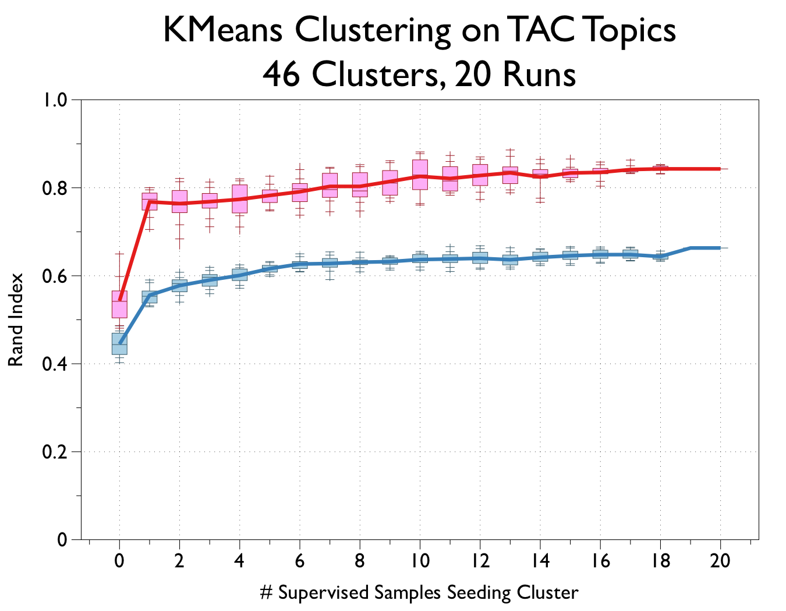
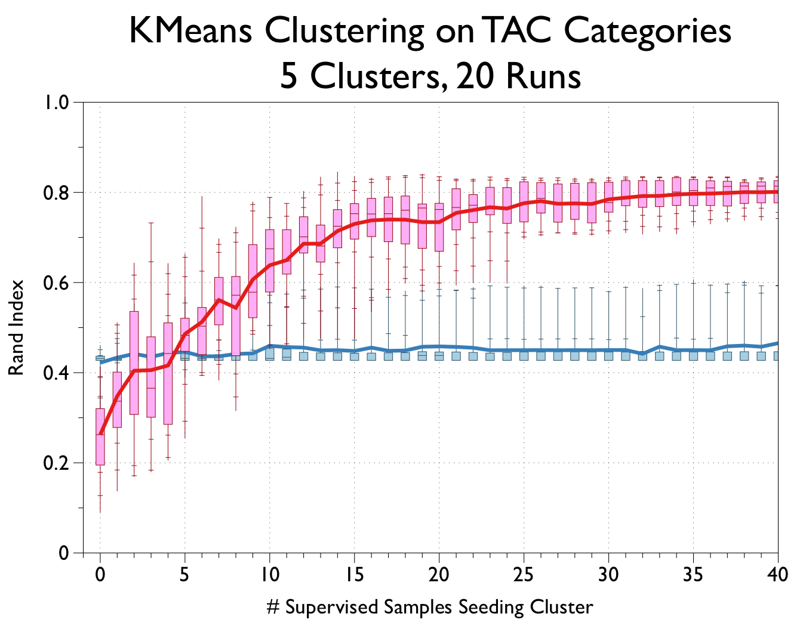

# TAC Semi-Supervised Cluster Experiments

This code gives an example of how a task, in this case document clustering, may be improved using varying amounts of supervised data.

## Usage
To run, make sure you install the requirements with:

    pip install -r requirements.txt

You should provide a `config.yml` file specifying paths to the AQUAINT and ENG_GW corpora, as well as paths for where the extracted documents and their pickled vectors will be saved.

Then, you can run with:

    python3 -m newsclusters.processing
    
### Options
    
    usage: processing.py [-h] [--vector-type {tfidf,glove}]
                     [--cluster-type {topic,category}] [-c CONFIG] [-f]
                     [--runs RUNS] [--max-samples MAX_SAMPLES]

	optional arguments:
	  -h, --help            show this help message and exit
	  --vector-type {tfidf,glove}
	                        Choose between tfidf or GloVe to represent documents
	                        as vectors
	  --cluster-type {topic,category}
	                        Choose between running experiments for clustering
	                        topics or categories as defined in the TREC data
	  -c CONFIG, --config CONFIG
	                        Path to the config file that specifies paths for the
	                        corpora
	  -f, --force           Force overwrite of already-generated vectors.
	  --runs RUNS           Number of test runs to perform
	  --max-samples MAX_SAMPLES
	                        Maximum number of supervised samples to use.

## Experiment Description

Using the AQUAINT and English Gigaword corpora from the [TAC 2009 Summarization Track](https://tac.nist.gov//2009/Summarization/), document clustering is performed on:

* **5** categories
* **46** topic clusters (docsets)

This code uses the documents named as belonging to a particular topic or category by the TAC guide `*_topics.xml` files. With a number of randomized runs, the code shows the effect of varying the number of sample documents used to create "seed" centroids for each [*k*-means](https://en.wikipedia.org/wiki/K-means_clustering) document cluster, from **0** (random initialization), **1** (single document) or any integer up to the maximum number of documents in each topic or category.

The result of the *k*-means algorithm is then compared against the true labels for the documents provided by the `*_topics.xml` file.

The results of running these experiments on 20 random initializations on the devtest data are shown in the graphs below, where the red refers to representing documents as tf*idf vectors using [scikit-learn](http://scikit-learn.org/), and the blue using pre-trained GloVe embeddings via [spacy](https://spacy.io).

## Results

